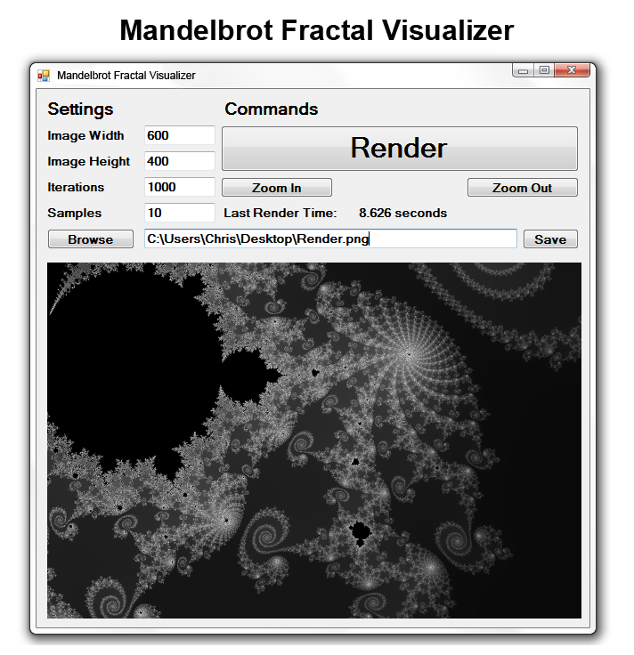

This was my first "real" program: a Mandelbrot fractal visualizer. It supports:

- **Supersampling** for pixel-perfect renders
- **Zooming** in and out
- Adjustable **iterations** of the Mandelbrot formula